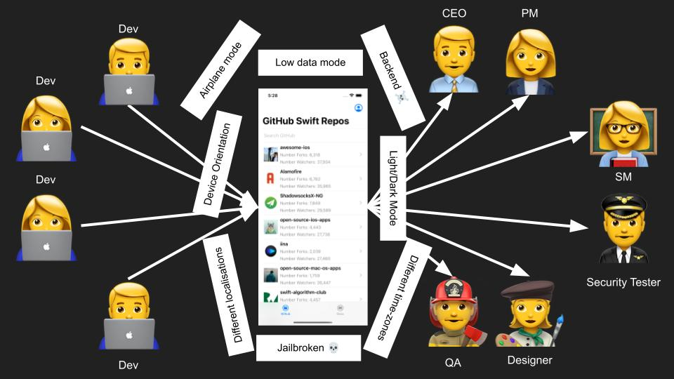
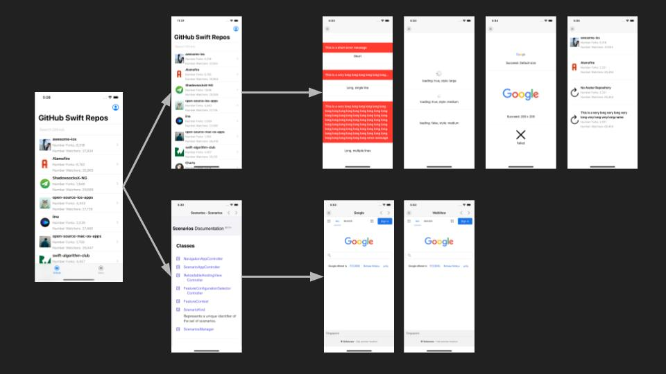
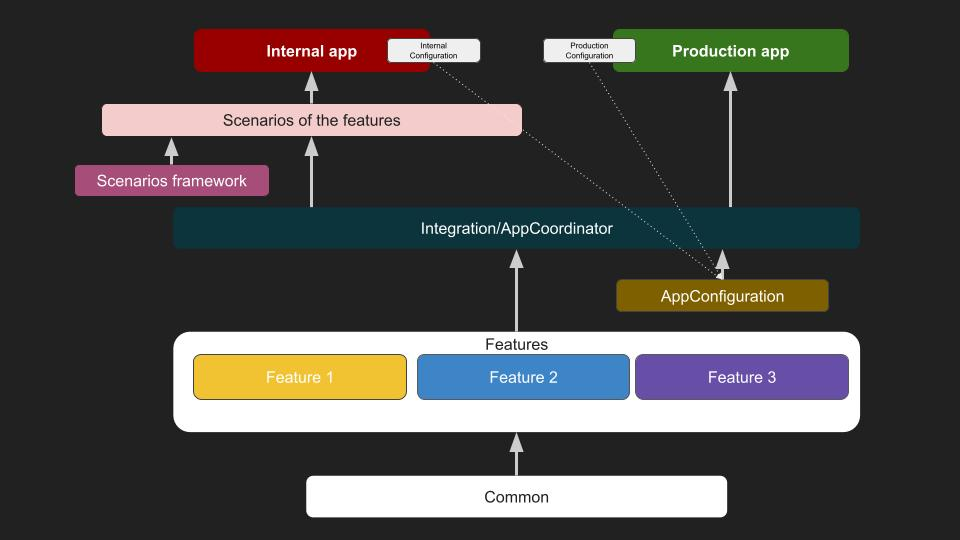

# Scenarios

Scenarios provides an infrastructure for fast prototyping and feature development for iOS Projects without breaking production apps

# Video presentation

[Watch the presentation about the framework at iOSConf 2022](https://www.youtube.com/watch?v=gbqC_67W_tg)

# Introduction

## Challenges of mobile frontend development

- Stories with multiple requirements.
- Multiple stakeholders (backend devs, designers, QAs, PMs, SMs, Testers, CTO, CEO ….).
- Multiple environments, configurations.
- Working on multiple features in parallel.
- Demonstrating multiple states for UI components.
- Mobile app deployment is complicated.
- Continuous delivery.

## Scenario-driven development

- Scenarios is a system supporting continuously delivering of incremental updates for mobile app frontends.
- Targeting early feedback loop from all stakeholders.
- Avoiding the need to deliver multiple apps for different purposes.
- Easing parallelism between feature teams.
- Supporting automated tests.
- Extensible, new types of scenarios can be created to accommodate different stakeholders: prototype scenario, design system scenario, accessibility scenario, etc ...

## Recommended modular architecture

## Sample app

There is a sample app inside this repository. The app fetches the list of popular Swift repositories from Github and display them in a UITableView.

The app will contain all scenarios for each of the components, as well as a mocking and a production environment scenarios.

https://user-images.githubusercontent.com/478757/136145086-85e43b43-9479-432a-b308-67533b51adad.mp4

# Getting Started

Please check out the Sample project.

# Acknowledgement

The original idea comes from the team working on [the NHS COVID-19 App](https://apps.apple.com/gb/app/nhs-covid-19/id1520427663)

The original source code is taken from the iOS source code of the [NHS Covid-19 App](https://github.com/nihp-public/covid-19-app-ios-ag-public)  

# License

MIT
